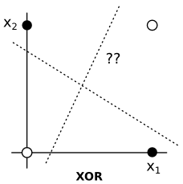

# Neural networks

Neural networks, also known as artificial neural networks, are a machine learning paradigm inspired by animal neurons. A neural network consists of many nodes, playing the role of neurons, connected via edges, playing the role of synaptic connections. Typically, the neurons are arranged in layers, with each layer fully connected to the next. The first and last layers are input and output layers, respectively. Inputs may be continuous (but normalized to [-1, 1]) or binary, while outputs are typically binary. The network is "trained" by repeatedly examining the training set; each repetition is called an "epoch." During each epoch, the weights on each edge are slightly adjusted in order to reduce the prediction error for the next epoch. We must decide when to stop training, i.e., how many epochs to execute. The resulting learned "model" consists of the network topology as well as the various weights.

## The animal neuron

{: .right}

A neuron consists of a cell body, a nucleus, the axon and axon terminals, and dendrites. The dendrites split into complex trees and receive signals from other neurons. Signals are sent through the axon terminals to other neurons.

Neurons are found throughout the nervous system (brain, spinal cord, periphery) but are most concentrated in the brain. A human brain has about 100 billion neurons. Each neuron has, on average, about 7000 connections to other neurons. This wouldn't be particularly remarkable except for the generally-accepted theory that the brain is an "information processing machine." That is to say, it is *computing* something with all those neurons. The question is, then, can properties of the brain be the reason humans are intelligent, and can those properties be used in systems we create?

The most intriguing property of the brain, apart from its massive connectivity, is that each neuron is more-or-less doing the same thing. Most neurons "activate" (discharge an electrical signal down the axon) based on whether or not neurons connected to it have recently activated themselves. Each connection to another neuron has a certain strength, so that if the connected neuron activates, a signal of a certain strength is received. The received signals add up, and may cause the receiving neuron itself to activate.

The signals have to add up in a certain time frame, otherwise they will just dissipate. If the receiving neuron does activate, it completely discharges. It is an "all or nothing" event. More received electrical charge does not create greater discharges; the amount of received charge only determines *if* an activation will occur.

Some connections among neurons are excitatory, which increase the chance of activation by the receiving neuron, and inhibitory which do the opposite.

Here is an image of the action potential (from [Wikipedia](http://en.wikipedia.org/wiki/File:Action_potential_vert.png)):

The connections among neurons and their strengths are not hard-wired. "Learning" is essentially the process of changing connections ("synaptic pruning") and their strengths ("synaptic plasiticity").

One important theory about how these changes come about is the Hebbian learning rule (from Donald Hebb, 1904-1985). It attempts to explain how connections strengthen:

> Let us assume that the persistence or repetition of a reverberatory activity (or "trace") tends to induce lasting cellular changes that add to its stability. [...] When an axon of cell A is near enough to excite a cell B and repeatedly or persistently takes part in firing it, some growth process or metabolic change takes place in one or both cells such that A's efficiency, as one of the cells firing B, is increased. — (Hebb, *The Organization of Behavior*, 1949)

This is often summarized as: "Cells that fire together, wire together." The theory would basically explain associative memory: if you repeatedly hear the birthday song while you are simultaneously looking at a birthday cake, eventually whenever you see or think about a birthday cake, you are reminded of the song.

## Neurons as inspiration: The perceptron

We want to build systems that exhibit some properties of the brain. These properties are:

- Simple, nearly-identical components (neurons)

- Massively-parallel computation

- A learning mechanism

These properties are important for several reasons. Systems built out of many similar (well, let's just say "identical") components may be more robust if we can be certain the design of the identical components is a good design. Massively-parallel computation promises that very complex tasks can be done in very little time; accomplishing this is still just pie in the sky for most systems built by humans. And if we have access to a reliable learning mechanisms, systems do not so much have to be designed but rather "trained." Perhaps we can build systems that begin like children but learn, on their own, to be highly capable. Perhaps we can just throw together a bunch of simple "neurons," show the system lots of training examples, and the system will do the rest of the work.

The first attempt was by [Frank Rosenblatt](http://www.rutherfordjournal.org/article040101.html#rosenblatt) in 1957. He designed the "perceptron," a computational unit that can be described by the following diagram.

The perceptron is analogous to a single neuron. It receives inputs from $x\_1, x\_2, x\_3$, etc. (any number of inputs). For convenience in the learning process, it also receives another input that is always the value 1.0. Each of these inputs are multiplied by a weight, to emulate the strength of the neural connection and whether it is excitatory or inhibitory (excitatory weights are positive, inhibitory weights are negative, usually). The inputs multiplied by the weights come into the perceptron and are summed. Then, a question has to be answered: does this perceptron (neuron) activate? A simple function decides this: if the sum is large enough, say above 0.5, then the perceptron activates, sending a 1 out the right side. Otherwise, it does not, sending a 0 out the right side.

$$
f\left(\sum_{i=1}^k x_{i} w_{ji} + w_{j0}\right) =
\begin{cases}
0 & \text{if sum } < 0.5 \\
1 & \text{if sum } \geq 0.5
\end{cases}
$$

Each percepton may be connected to others, so that a perceptron's output can be other perceptrons' inputs. However, it turns out that the complexity of the network greatly affects how learning will work.

The first property to notice about perceptrons is that a single perceptron can compute simple logic functions, assuming we have binary inputs. For example,

Outputs of perceptrons can become inputs to other perceptrons, allowing us to build all possible logic circuits. Thus, perceptrons are capable of general computation, putting them in the large class of fantastically different systems that are Turing-complete. A Turing-complete system is able to compute anything that can be computed; examples include electrical logic gates (i.e., a typical computer), the Lambda calculus, cellular automata, and now neural networks.

But can a complex network learn? When we say "learn," we mean: can the weights be assigned via a training process rather than assigned manually? This would be ideal: just put together a bunch of perceptrons, give it lots of examples (e.g., examples of prime numbers and composite numbers), and let it figure out how to set the weights so that it turns into a machine that computes that function (e.g., the function to determine if a number is prime or not).

## The perceptron learning algorithm

Look again at the definition of the threshold function:

$$
f\left(\sum_{i=1}^k x_{i} w_{ji} + w_{j0}\right) =
\begin{cases}
0 & \text{if sum } < 0.5 \\
1 & \text{if sum } \geq 0.5
\end{cases}
$$

Suppose we want to train a single perceptron. We want that function to be 1 for positive examples and 0 for negative examples. This means we want the sum of the inputs to be at least 0.5 for positive examples, and less for negative examples.

The sum is a linear function. It can be "trained" using typical methods that work on linear functions. One such method is gradient descent (or ascent), a.k.a. hill-climbing. Normally, with gradient descent, we compute the derivative (gradient) of the objective function (the threshold function $f$) and determine which direction is the greatest gradient, and adjust the weights. However, the threshold function is not differentiable (it is a step function, discontinous at 0.5), but we have a shortcut.

Let $d\_j$ be the true ($d$ for "desired") answer for some input vector, and $y\_j$ but the output computed by the $j$'th perceptron with its current weights $w\_{ij}$ (weight from input $i$ to this perceptron $j$). We do not want to adjust the weights if the output is correct. If the output is 0 and we should have yielded a 1, then the weights are too low, and should be adjusted up. If the output is a 1 and we wanted a 0, the weights are too high. Of course, we only want to adjust a tiny bit, so we do not oscillate. Thus, we have the following adjustment for each weight:

$$w'_{ij} = w_{ij} + \alpha (d_j-y_j)x_i,$$

where $w'\_{ij}$ is the new weight and $\alpha$ is a small number (0.1, or 0.01, etc.). Each weight is adjusted based on the input $x_i$ that corresponds to that weight since some inputs are large and others small (possibly even negative if we get away from boolean inputs). Weights may become large, small, or even negative depending on the nature of the function being learned and the nature of the inputs. Since each adjustment is so small, the same perceptron may need to be shown the same (positive and negative) examples many times. When a perceptron is shown all examples once, we say it has trained on one "epoch." Often we train across hundreds or thousands of epochs.

A single perceptron can have many inputs; perhaps thousands. What kinds of functions can it learn? Recall the sum of the weighted inputs is a linear function. The threshold function just says "yes" or "no" based on this sum. Suppose there are two inputs: then the weighted sum describes a line in 2D. The threshold function just says "yes" if an input vector is above (or below) the line, or exactly on the line, and "no" otherwise.

Here is a diagram of this threshold line:

The answer is, therefore, that a perceptron can learn any "linearly separable" function. If the positive examples and negative examples can be plotted (possibly in higher dimensions), and there exists a line/plane that separates the two classes, then a perceptron can learn that line/plane. We know this because the line/plane can be described by a weighted sum of the inputs. This fact is why you may find perceptrons described in terms of "computational geometry" — they are effectively learning geometric functions.

It turns out that not all functions are linearly separable. The simplest case is the XOR function. You can plot it like so:

There is simply no line that separates the positive and negative examples of the XOR function. A perceptron cannot learn this function.

This is such a basic function that, when Minsky and Papert proved in 1969 that XOR could not be learned, perceptrons took a huge hit. Research in neural networks did not fully recover until the 1980s, when a new learning mechanism was discovered.

## Single-layer perceptron networks

Putting lots of perceptrons together in a single-layer network changes nothing. They all learn independently. (So XOR still cannot be learned.) However, we can get more than 0/1 as an output. We can get any number of outputs we wish.

These networks are "fully connected" and "feed-forward" — fully connected because each input connects to every perceptron, and feed-forward because there are no loops. "Recurrent" networks have loops, where the output of some perceptron becomes the input to another perceptron earlier in the chain, or an input to itself. Recurrent networks are decidedly more complex (they can be dynamic non-linear systems) but are able to keep memories and other such interesting features.

## Logistic (sigmoid) perceptrons

When the function being learned is not linearly separable, the threshold function causes some oscillating. This is because points near the separator are continually changing classifications as the weights update and move the separator.

We also may desire probabilistic answers rather than yes/no answers. If the data cannot actually be separated, then classifications near boundary should be less confident than classifications far from the boundary. It would be nice if the perceptrons can report this confidence as a classification probability.

The threshold function we saw cannot do this for us. We need a continuous function that looks the same but gives graded answers.

A good choice is the logistic function, also known as the sigmoid function:

$$f(s_j) = \frac{1}{1+e^{-s_j}}$$

where $s\_j = \sum_{i=1}^k x\_{i} w\_{ij} + w\_{0j}$. This is what it looks like (from [Wikipedia](http://en.wikipedia.org/w/index.php?title=File:Logistic-curve.svg&page=1)):

Since we no longer have binary outputs, but rather probabilistic ones, we need to change our evaluation function. An output is no longer either correct or incorrect. If the true answer is 1.0, and the logistic function gives 0.79, then we say the error is 0.21. For the sake of easy derivatives, we'll go further and say the error, now called the "loss," is the square of the difference:

$$L_j(d_j, f(s_j)) = (d_j - f(s_j))^2,$$

where $d\_j$ is the correct answer (1.0 or 0.0, binary), and $f(s\_j)$ is the value from the activation function. We'll say the total loss is the sum of the loss from each perceptron. (Recall that a single-layer perceptron network is just a collection of independent perceptrons, which are essentially trained separately.)

Our learning algorithm needs to be revised. Luckily, we can just work backwards from the loss function and attempt to walk up/down the gradient. Since the activation function and the loss function are differentiable, this gradient is easy to find for each weight separately.

$$
\begin{eqnarray}
\frac{\partial L_j}{\partial w_{ij}}
&=& \frac{\partial}{\partial w_{ij}} (d_j - f(s_j))^2 \qquad \text{by definition of } L \\
&=& 2 (d_j - f(s_j)) \frac{\partial}{\partial w_{ij}} (d_j - f(s_j)) \qquad \text{chain rule} \\
&=& -2 (d_j - f(s_j)) f'(s_j) \frac{\partial}{\partial w_{ij}} s_j \qquad \text{chain rule}\\
&=& -2 (d_j - f(s_j)) f'(s_j) \frac{\partial}{\partial w_{ij}} \sum_{i'=1}^k x_{i'} w_{i'j} + w_{0j} \qquad \text{expand } s_j\\
&=& -2 (d_j - f(s_j)) f'(s_j) x_{i} \qquad \text{picks out } x_{i} w_{ij} \text{, whose derivative is } x_{i}
\end{eqnarray}
$$

Note that $f'(z) = f(z)(1-f(z))$. This makes the logistic function a good choice (in addition to its shape, which approximates the threshold function). We can push the $2$ into the $\alpha$ parameter, yielding:

$$\frac{\partial L_j}{\partial w_{ij}} = -\alpha (d_j - f(s_j)) f(s_j) (1 - f(s_j)) x_{i}$$

We want to update our weights in the opposite direction of the loss gradient. So our weight update is the following:

$$w^{\text{new}}_{ij} = w_{ij} + \alpha (d_j - f(s_j)) f(s_j) (1 - f(s_j))) x_{i}$$

### Example of a logistic single-layer perceptron network

As an example, consider the task of classifying handwritten digits with classes 0-9. Here are some examples (intentionally pixelated to reduce the input space, i.e., the number of pixels):

We can visualize the loss with respect to epochs for different learning rates. The plot shows the loss on the validation (testing) set of examples, not the training set. Notice at larger learning rates (say, 0.5), the loss increases with more epochs. This is called "overfitting," meaning that the training set loss is decreasing while the validation loss is increasing.

## Multilayer perceptron networks

Single layer perceptron networks can only learn linear functions, as before (except now there is a fuzzy boundary, matching that of the logistic curve). Each output neuron is independent of all others, so you can think of a single layer perceptron network as independent 1-perceptron networks.

In order to be able to learn all possible functions, including XOR and everything else, we have to stack more layers. Each middle layer can combine outputs of the previous layer and thereby represent a more complex function. The middle layers are called "hidden" layers because they do not directly relate to the output.

### Derivation of learning rule (backpropagation)

Above, we computed the learning procedure (weight update function) for a single logistic perceptron. We can apply such a function to multiple perceptrons in a single layer, since they each activate and learn independently. However, learning is more complicated when hidden layers are involved. In this case, the output layer does not directly receive input from the training data; instead, the output layer receives inputs from neurons in an earlier layer. Likewise, a neuron that is not directly connected to the output cannot use the "loss" function to figure out the error for that inner neuron. Instead, we must "propagate" the loss from the one layer back to an earlier layer. Hence, this technique is called "backpropagation."

For an output neuron $j$, we can directly use the loss (desired value minus predicted value, squared) and the output $t_i$ of the previous neuron $i$ attached to weight $w_{ij}$:

$$
\begin{eqnarray}
\frac{\partial L_j}{\partial w_{ij}}
&=& \frac{\partial L_j}{\partial f(s_j)} \frac{\partial f(s_j)}{\partial s_j} \frac{\partial s_j}{\partial w_{ij}} \\
&=& \frac{\partial}{\partial f(s_j)} (d_j - f(s_j))^2 \frac{\partial f(s_j)}{\partial s_j} \frac{\partial s_j}{\partial w_{ij}} \qquad \text{by definition of }L\\
&=& -2(d_j - f(s_j)) \frac{\partial f(s_j)}{\partial s_j} \frac{\partial s_j}{\partial w_{ij}} \qquad \text{chain rule}\\
&=& -2(d_j - f(s_j)) f'(s_j) \frac{\partial s_j}{\partial w_{ij}} \qquad \text{chain rule} \\
&=& -2(d_j - f(s_j)) f'(s_j) \frac{\partial}{\partial w_{ij}} \left( \sum_{i'} t_{i'}w_{i'j} + w_{0j} \right) \qquad \text{by definition of }s_j \\
&=& 2(d_j - f(s_j)) f'(s_j) t_i.
\end{eqnarray}
$$

Be forewarned that we're going to call $2(d\_j-f(s\_j))f'(s\_j)$ by the name $\Delta\_j$ (possibly with a different subscript) later on. That value represents the error before weighting that error by the particular input value $t\_i$.

For a hidden neuron $j$ connected forward to various nodes $K$ and receiving input $t_i$ attached to weight $w_{ij}$, the derivation is as follows. Note, if neuron $j$ is in the first layer, then $t_i$ is an actual input value $x_i$.

$$
\begin{eqnarray}
\frac{\partial L_j}{\partial w_{ij}}
&=& \frac{\partial L_j}{\partial f(s_j)} \frac{\partial f(s_j)}{\partial s_j} \frac{\partial s_j}{\partial w_{ij}} \qquad \text{(as before)} \\
&=& \left( \sum_{k \in K} \frac{\partial L_k}{\partial f(s_k)} \frac{\partial f(s_k)}{\partial s_k} \frac{\partial s_k}{\partial f(s_j)} \right) \frac{\partial f(s_j)}{\partial s_j} \frac{\partial s_j}{\partial w_{ij}} \qquad \text{loss for this neuron is sum of losses in next layer}\\
&=& \left( \sum_{k \in K} \frac{\partial L_k}{\partial f(s_k)} \frac{\partial f(s_k)}{\partial s_k}  \frac{\partial}{\partial f(s_j)} \left( \sum_{k'} t_{k'}w_{jk'} + w_{0k'} \right) \right) \frac{\partial f(s_j)}{\partial s_j} \frac{\partial s_j}{\partial w_{ij}} \qquad \text{rewrite } s_k\\
&=& \left( \sum_{k \in K} \frac{\partial L_k}{\partial f(s_k)} \frac{\partial f(s_k)}{\partial s_k}  w_{jk} \right) \frac{\partial f(s_j)}{\partial s_j} \frac{\partial s_j}{\partial w_{ij}} \qquad \text{since } f(s_j)=t_{k'} \text{ when } k'=k \\
&=& \left( \sum_{k \in K} \Delta_{jk} w_{jk} \right) \frac{\partial f(s_j)}{\partial s_j} \frac{\partial s_j}{\partial w_{ij}} \qquad \text{rewrite } \frac{\partial L_k}{\partial f(s_k)} \frac{\partial f(s_k)}{\partial s_k} \text{ as } \Delta_{k} \text{, calculated previously}\\
&=& \left(\sum_{k \in K} \Delta_{k} w_{jk}\right) f'(s_j) \frac{\partial}{\partial w_{ij}} \left( \sum_{i'} t_{i'} w_{i'j} + w_{0j} \right) \qquad \text{expand } s_j\\
&=& \left(\sum_{k \in K} \Delta_{k} w_{jk}\right) f'(s_j) t_i. \qquad \text{apply partial derivative}
\end{eqnarray}
$$

The error of the weights must be calculated at the output layer first to derive the value $\Delta\_{k}$, then those errors are used to calculate the weight updates for the preceding hidden layer, and so on backwards. This known as "backpropagation" of error gradients because each inner layer computes its weight updates based on the error, $\Delta\_{k}$, from the next layer. If the next layer is an output layer, then $\Delta\_{k} = 2(d\_k-f(s\_k))f'(s\_k)$ from before.

### Performance of multilayer perceptron on optdigits

From Weka:

~~~
=== Evaluation on test split ===
=== Summary ===

Correctly Classified Instances         551               98.0427 %
Incorrectly Classified Instances        11                1.9573 %
Kappa statistic                          0.9782
Mean absolute error                      0.0058
Root mean squared error                  0.0612
Relative absolute error                  3.2483 %
Root relative squared error             20.4131 %
Total Number of Instances              562     

=== Detailed Accuracy By Class ===

               TP Rate   FP Rate   Precision   Recall  F-Measure   ROC Area  Class
                 0.962     0          1         0.962     0.981      0.999    0
                 0.957     0.002      0.978     0.957     0.968      0.998    1
                 1         0.002      0.982     1         0.991      1        2
                 0.939     0.004      0.969     0.939     0.954      1        3
                 1         0.002      0.984     1         0.992      1        4
                 0.982     0.008      0.931     0.982     0.956      0.999    5
                 1         0.002      0.982     1         0.991      1        6
                 0.984     0.002      0.984     0.984     0.984      1        7
                 0.983     0          1         0.983     0.991      0.999    8
                 1         0          1         1         1          1        9
Weighted Avg.    0.98      0.002      0.981     0.98      0.98       1    

=== Confusion Matrix ===

  a  b  c  d  e  f  g  h  i  j   <-- classified as
 51  0  1  0  0  0  1  0  0  0 |  a = 0
  0 45  0  0  1  0  0  1  0  0 |  b = 1
  0  0 55  0  0  0  0  0  0  0 |  c = 2
  0  0  0 62  0  4  0  0  0  0 |  d = 3
  0  0  0  0 63  0  0  0  0  0 |  e = 4
  0  0  0  1  0 54  0  0  0  0 |  f = 5
  0  0  0  0  0  0 56  0  0  0 |  g = 6
  0  0  0  1  0  0  0 62  0  0 |  h = 7
  0  1  0  0  0  0  0  0 58  0 |  i = 8
  0  0  0  0  0  0  0  0  0 45 |  j = 9
~~~

